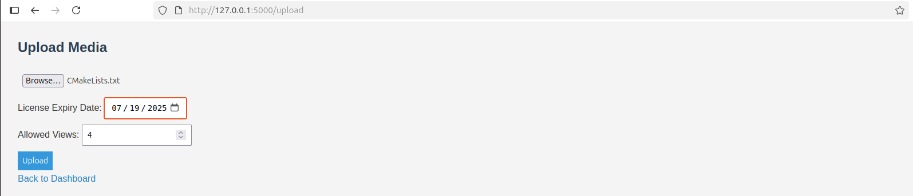

# DRM-Protected Media Sharing System

This is a Flask-based web application that allows users to:
- Register and login
- Upload media files with a license that restricts expiry date and allowed number of views
- Download and view encrypted media with DRM enforcement

---

## Features

- User registration & login
- Media encryption using Fernet (symmetric encryption)
- Media upload with license control (expiry & views)
- License enforcement before allowing downloads
- Decryption on download
- Original files are deleted after encryption

---

## Requirements

- Python 3.8+
- pip
- venv

### Python Libraries
Install with:

```bash
pip install -r requirements.txt
```

**requirements.txt**
```
Flask
cryptography
werkzeug
```

---

## Setup Instructions

### 1. Clone or download the project
```bash
cd ~/Downloads
mkdir drm_system
cd drm_system
```

### 2. Create & activate a virtual environment

```bash
sudo apt install python3.12-venv 
python3 -m venv venv
source venv/bin/activate
```

### 3. Install dependencies

```bash
pip install Flask cryptography werkzeug
```

### 4. Project Structure

```
drm_system/
│
├── app.py
├── drm_utils.py
├── db.sqlite3         ← Automatically created
├── secret.key         ← Automatically created
│
├── templates/
│   ├── login.html
│   ├── register.html
│   ├── index.html
│   └── upload.html
│
├── static/
│   └── styles.css
│
└── media/              ← Encrypted media storage
```

### 5. Run the app

```bash
python app.py
```

Or using Flask:

```bash
export FLASK_APP=app.py
flask run
```

Visit [http://127.0.0.1:5000](http://127.0.0.1:5000)

---

## Usage

1. Register a new user
2. Log in
3. Upload a media file with:
   - Expiry date
   - Number of views
4. Media gets encrypted and saved
5. You can view/download your file — only if:
   - The license has not expired
   - Views are remaining

---

## Notes

- This project is **for educational/demo purposes**
- Not suitable for production without further security hardening
- Decrypted files are temporary and can be deleted automatically if needed

---

## Screenshots

### Login Page


### Register Page


### Upload Media Page





### Dashboard with Files


---
---

## 📃 License

MIT License
